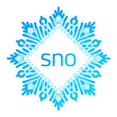
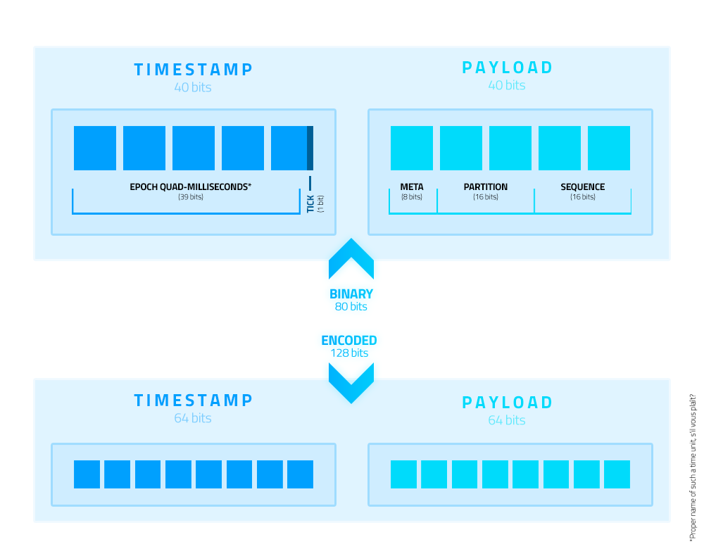

A spec for **unique IDs in distributed systems** based on the Snowflake design, i.e. a coordination-based ID variant. 
It aims to be friendly to both machines and humans, compact, *versatile* and fast.

This repository contains a **Go** package for generating such IDs. 

[](https://pkg.go.dev/github.com/muyo/sno?tab=doc) 
[](https://github.com/muyo/sno/releases) 
[](https://travis-ci.com/muyo/sno) 
[](https://codecov.io/gh/muyo/sno)
[](https://goreportcard.com/report/github.com/muyo/sno) 
[](https://raw.githubusercontent.com/muyo/sno/master/LICENSE) 
```bash
go get -u github.com/muyo/sno
```

### Features

- **Compact** - **10 bytes** in its binary representation, canonically [encoded](#encoding) as **16 characters**.
  <br />URL-safe and non-ambiguous encoding which also happens to be at the binary length of UUIDs - 
  **sno**s can be stored as UUIDs in your database of choice.
- **K-sortable** in either representation.
- **[Embedded timestamp](#time-and-sequence)** with a **4msec resolution**, bounded within the years **2010 - 2079**. 
  <br />Handles clock drifts gracefully, without waiting.
- **[Embedded byte](#metabyte)** for arbitrary data.
- **[Simple data layout](#layout)** - straightforward to inspect or encode/decode.
- **[Optional and flexible](#usage)** configuration and coordination.
- **[Fast](./benchmark#results)**, wait-free, safe for concurrent use.
<br />Clocks in at about 500 LoC, has no external dependencies and minimal dependencies on std.
- ‭A pool of **≥ 16,384,000** IDs per second.
<br /> 65,536 guaranteed unique IDs per 4msec per partition (65,536 combinations) per metabyte 
(256 combinations) per tick-tock (1 bit adjustment for clock drifts). 
**549,755,813,888,000** is the global pool **per second** when all components are taken into account.

### Non-features / cons

- True randomness. **sno**s embed a counter and have **no entropy**. They are not suitable in a context where 
unpredictability of IDs is a must. They still, however, meet the common requirement of keeping internal counts 
(e.g. total number of entitites) unguessable and appear obfuscated;
- Time precision. While *good enough* for many use cases, not quite there for others. The ➜ [Metabyte](#metabyte)
  can be used to get around this limitation, however.
- It's 10 bytes, not 8. This is suboptimal as far as memory alignment is considered (platform dependent).


<br />

## Usage (➜ [API](https://pkg.go.dev/github.com/muyo/sno?tab=doc))

**sno** comes with a package-level generator on top of letting you configure your own generators. 

Generating a new ID using the defaults takes no more than importing the package and:

```go
id := sno.New(0)
```

Where `0` is the ➜ [Metabyte](#metabyte).<br />

The global generator is immutable and private. It's therefore also not possible to restore it using a Snapshot. 
Its Partition is based on time and changes across restarts.

### Partitions (➜ [doc](https://pkg.go.dev/github.com/muyo/sno?tab=doc#Partition))

As soon as you run more than 1 generator, you **should** start coordinating the creation of Generators to 
actually *guarantee* a collision-free ride. This applies to all specs of the Snowflake variant.

Partitions are one of several friends you have to get you those guarantees. A Partition is 2 bytes. 
What they mean and how you define them is up to you.

```go
generator, err := sno.NewGenerator(&sno.GeneratorSnapshot{
	Partition: sno.Partition{'A', 10}
}, nil)
```

Multiple generators can share a partition by dividing the sequence pool between 
them (➜ [Sequence sharding](#sequence-sharding)).

### Snapshots (➜ [doc](https://pkg.go.dev/github.com/muyo/sno?tab=doc#GeneratorSnapshot))

Snapshots happen to serve both as configuration and a means of saving and restoring generator data. They are 
optional - simply pass `nil` to `NewGenerator()`, to get a Generator with sane defaults and a unique (in-process)
Partition.

Snapshots can be taken at runtime:

```go
s := generator.Snapshot()
```

This exposes most of a Generator's internal bookkeeping data. In an ideal world where programmers are not lazy 
until their system runs into an edge case - you'd persist that snapshot across restarts and restore generators 
instead of just creating them from scratch each time. This will keep you safe both if a large clock drift happens 
during the restart -- or before, and you just happen to come back online again "in the past", relative to IDs that 
had already been generated.

A snapshot is a sample in time - it will very quickly get stale. Only take snapshots meant for restoring them 
later when generators are already offline - or for metrics purposes when online.


<br />

## Layout

A **sno** is simply 80-bits comprised of two 40-bit blocks: the **timestamp** and the **payload**. The bytes are 
stored in **big-endian** order in all representations to retain their sortable property.

Both blocks can be inspected and mutated independently in either representation. Bits of the components in the binary 
representation don't spill over into other bytes which means no additional bit twiddling voodoo is necessary* to extract 
them.

\*The tick-tock bit in the timestamp is the only exception (➜ [Time and sequence](#time-and-sequence)).

<br />

## Time and sequence

### Time

**sno**s embed a timestamp comprised of 39 bits with the epoch **milliseconds at a 4msec resolution** (floored, 
unsigned) and one bit, the LSB of the entire block - for the tick-tock toggle.

### Epoch

The **epoch is custom** and **constant**. It is bounded within `2010-01-01 00:00:00 UTC` and 
`2079-09-07 15:47:35.548 UTC`. The lower bound is `1262304000` seconds relative to Unix. 

If you *really* have to break out of the epoch - or want to store higher precision - the metabyte is your friend.

### Precision

Higher precision *is not necessarily* a good thing. Think in dataset and sorting terms, or in sampling rates. You 
want to grab all requests with an error code of `403` in a given second, where the code may be encoded in the metabyte. 
At a resolution of 1 second, you binary search for just one index and then proceed straight up linearly. 
That's simple enough.

At a resolution of 1msec however, you now need to find the corresponding 1000 potential starting offsets because 
your `403` requests are interleaved with the `200` requests (potentially). At 4msec, this is 250 steps.

Everything has tradeoffs. This was a compromise between precision, size, simple data layout -- and factors like that above.

### Sequence

**sno**s embed a sequence (2 bytes) that is **relative to time**. It does not overflow and resets on each new time 
unit (4msec). A higher sequence within a given timeframe **does not necessarily indicate order of creation**. 
It is not advertised as monotonic because its monotonicity is dependent on usage. A single generator writing 
to a single partition, *ceteris paribus*, *will* result in monotonic increments and *will* represent order of creation. 

With multiple writers in the same partition, increment order is *undefined*. If the generator moves back in time, 
the order will still be monotonic but sorted either 2msec after or before IDs previously already written at that 
time (see tick-tock).

#### Sequence sharding

The sequence pool has a range of `[0..65535]` (inclusive). **sno** supports partition sharing out of the box 
by further sharding the sequence - that is multiple writers (generators) in the same partition.

This is done by dividing the pool between all writers, via user-specified bounds.

A generator will reset to its lower bound on each new time unit - and will never overflow its upper bound. 
Collisions are therefore guaranteed impossible unless misconfigured and they overlap with another 
*currently online* generator. 


<details>
<summary>Star Trek: Voyager mode, <b>How to shard sequences</b></summary>
<p>

This can be useful when multiple containers on one physical machine are to write as a cluster to a partition 
defined by the machine's ID (or simpler - multiple processes on one host). Or if multiple remote 
services across the globe were to do that.

```go
var PeoplePartition = sno.Partition{'P', 0}

// In process/container/remote host #1
generator1, err := sno.NewGenerator(&sno.GeneratorSnapshot{
	Partition: PeoplePartition,
	SequenceMin: 0,
	SequenceMax: 32767 // 32768 - 1
}, nil)

// In process/container/remote host #2
generator2, err := sno.NewGenerator(&sno.GeneratorSnapshot{
	Partition: PeoplePartition,
	SequenceMin: 32768,
	SequenceMax: 65535 // 65536 - 1
}, nil)
```

You will notice that we have simply divided our total pool of 65,536 into 2 even and **non-overlapping** 
sectors. In the first snapshot `SequenceMin` could be omitted - and `SequenceMax` in the second, as those are the 
defaults used when they are not defined. You will get an error when trying to set limits above the capacity of 
generators, but since the library is oblivious to your setup - it cannot warn you about overlaps and cannot 
resize on its own either. 

The pools can be defined arbitrarily - as long as you make sure they don't overlap across *currently online* 
generators. 

It is safe for a range previously used by another generator to be assigned to a different generator under the
following conditions:
- it happens in a different timeframe *in the future*, i.e. no sooner than after 4msec have passed (no orchestrator 
  is fast enough to get a new container online to replace a dead one for this to be a worry);
- if you can guarantee the new Generator won't regress into a time the previous Generator was running in.

If you create the new Generator using a Snapshot of the former as it went offline, you do not need to worry about those
conditions and can resume writing to the same range immediately - the obvious tradeoff being the need to coordinate 
the exchange of Snapshots.

If your clusters are always fixed size - reserving ranges is straightforward. With dynamic sizes, a potential simple 
scheme is to reserve the lower byte of the partition for scaling. Divide your sequence pool by, say, 8, keep 
assigning higher ranges until you hit your divider. When you do, increment partition by 1, start assigning 
ranges from scratch. This gave us 2048 identifiable origins by using just one byte of the partition.

That said, the partition pool available is large enough that the likelihood you'll ever *need* 
this is slim to none. Suffice to know you *can* if you want to. 

Besides for guaranteeing a collision-free ride, this approach can also be used to attach more semantic meaning to 
partitions themselves, them being placed higher in the sort order. 
In other words - with it, the origin of an ID can be determined by inspecting the sequence 
alone, which frees up the partition for another meaning.

How about...

```go
var requestIDGenerator, _ = sno.NewGenerator(&GeneratorSnapshot{
    SequenceMax: 32767,
}, nil)

type Service byte
type Call byte

const (
    UsersSvc   Service = 1
    UserList   Call    = 1
    UserCreate Call    = 2
    UserDelete Call    = 3
)

func genRequestID(svc Service, methodID Call) sno.ID {
    id := requestIDGenerator.New(byte(svc))
    // Overwrites the upper byte of the fixed partition. 
    // In our case - we didn't define it but gave a non-nil snapshot, so it is {0, 0}.
    id[6] = byte(methodID)

    return id
}
```

</p>
</details>

#### Sequence overflow

Remember that limiting the sequence pool also limits max throughput of each generator. For an explanation on what 
happens when you're running at or over capacity, see the details below or take a look at ➜ [Benchmarks](#benchmarks) 
which explains the numbers involved.

<details>
<summary>Star Trek: Voyager mode, <b>Behaviour on sequence overflow</b></summary>
<p>

The sequence never overflows and the generator is designed with a single-return `New()` method that does not return 
errors nor invalid IDs. *Realistically* the default generator will never overflow simply because you won't saturate 
the capacity.

But since you can set bounds yourself, the capacity could shrink to `4` per 4msec (smallest allowed). 
Now that's more likely. So when you start overflowing, the generator will *stall* and *pray* for a 
reduction in throughput sometime in the near future. 

From **sno**'s persective requesting more IDs than it can safely give you **immediately** is not an error - but 
it *may* require correcting on *your end*. And you should know about that. Therefore, if 
you want to know when it happens - simply give **sno** a channel along with its configuration snapshot.

When a thread requests an ID and gets stalled, **once** per time unit, you will get a `SequenceOverflowNotification` 
on that channel.

```go
type SequenceOverflowNotification struct {
    Now   time.Time // Time of tick.
    Count uint32    // Number of currently overflowing generation calls.
    Ticks uint32    // For how many ticks in total we've already been dealing with the *current* overflow.
}
```
Keep track of the counter. If it keeps increasing, you're no longer bursting - you're simply over capacity 
and *eventually* need to slow down or you'll *eventually* starve your system. The `Ticks` count lets you estimate
how long the generator has already been overflowing without keeping track of time yourself. A tick is *roughly* 1ms.

The order of generation when stalling occurs is `undefined`. It is not a FIFO queue, it's a race. Previously stalled 
goroutines get woken up alongside inflight goroutines which have not yet been stalled, where the order of the former is 
handled by the runtime. A livelock is therefore possible if demand doesn't decrease. This behaviour *may* change and 
inflight goroutines *may* get thrown onto the stalling wait list if one is up and running, but this requires careful 
inspection. And since this is considered an unrealistic scenario which can be avoided with simple configuration, 
it's not a priority.

</p>
</details>

#### Clock drift and the tick-tock toggle

Just like all other specs that rely on clock times to resolve ambiguity, **sno**s are prone to clock drifts. But
unlike all those others specs, **sno** adjusts itself to the new time - instead of waiting (blocking), it tick-tocks.

**The tl;dr** applying to any system, really: ensure your deployments use properly synchronized system clocks 
(via NTP) to mitigate the *size* of drifts. Ideally, use a NTP server pool that applies 
a gradual [smear for leap seconds](https://developers.google.com/time/smear). Despite the original Snowflake spec 
suggesting otherwise, using NTP in slew mode (to avoid regressions entirely) 
[is not always a good idea](https://www.redhat.com/en/blog/avoiding-clock-drift-vms).

Also remember that containers tend to get *paused* meaning their clocks are paused with them.

As far as **sno**, collisions and performance are concerned, in typical scenarios you can enjoy a wait-free ride  
without requiring slew mode nor having to worry about even large drifts.

<details>
<summary>Star Trek: Voyager mode, <b>How tick-tocking works</b></summary>
<p>

**sno** attempts to eliminate the issue *entirely* - both despite and because of its small pool of bits to work with.

The approach it takes is simple - each generator keeps track of the highest wall clock time it got from the OS\*, 
each time it generates a new timestamp. If we get a time that is lower than the one we recorded, i.e. the clock 
drifted backwards and we'd risk generating colliding IDs, we toggle a bit - stored from here on out in 
each **sno** generated *until the next regression*. Rinse, repeat - tick, tock.

(\*IDs created with a user-defined time are exempt from this mechanism as their time is arbitrary. The means 
to *bring your own time* are provided to make porting old IDs simpler and is assumed to be done before an ID 
scheme goes online)

In practice this means that we switch back and forth between two alternating timelines. Remember how the pool 
we've got is 16,384,000 IDs per second? When we tick or tock, we simply jump between two pools with the same 
capacity.

Why not simply use that bit to store a higher resolution time fraction? True, we'd get twice the pool which 
seemingly boils down to the same - except it doesn't. That is due to how the sequence increases. Even if you 
had a throughput of merely 1 ID per hour, while the chance would be astronomically low - if the clock drifted 
back that whole hour, you *could* get a collision. The higher your throughput, the bigger the probability. 
ID's of the Snowflake variant, **sno** being one of them, are about **guarantees - not probabilities**. 
So this is a **sno-go**.

(I will show myself out...)

The simplistic approach of tick-tocking *entirely eliminates* that collision chance - but with a rigorous assumption: 
regressions happen at most once into a specific period, i.e. from the highest recorded time into the past 
and never back into that particular timeframe (let alone even further into the past). 

This *generally* is exactly the case but oddities as far as time synchronization, bad clocks and NTP client 
behaviour goes *do* happen. And in distributed systems, every edge case that can happen - *will* happen. What do?

##### How others do it

- [Sonyflake] goes to sleep until back at the wall clock time it was already at 
previously. All goroutines attempting to generate are blocked.
- [snowflake] hammers the OS with syscalls to get the current time until back 
at the time it was already at previously. All goroutines attempting to generate are blocked.
- [xid] goes ¯\\_(ツ)_/¯ and does not tackle drifts at all.
- Entropy-based specs (like UUID or KSUID) don't really need to care as they are generally not prone, even to 
extreme drifts - you run with a risk all the time.

The approach one library took was to keep generating, but timestamp all IDs with the highest time recorded instead. 
This worked, because it had a large entropy pool to work with, for one (so a potential large spike in IDs generated 
in the same timeframe wasn't much of a consideration). **sno** has none. But more importantly - it disagrees on the 
reasoning about time and clocks. If we moved backwards, it means that an *adjustment* happened and we are *now* 
closer to the *correct* time from the perspective of a wider system.

**sno** therefore keeps generating without waiting, using the time as reported by the system - in the "past" so to 
speak, but with the tick-tock bit toggled.

*If* another regression happens, into that timeframe or even further back, *only then* do we tell all contenders 
to wait. We get a wait-free fast path *most of the time* - and safety if things go southways.

##### Tick-tocking obviously affects the sort order as it changes the timestamp

Even though the toggle is *not* part of the milliseconds, you can think of it as if it were. Toggling is then like 
moving two milliseconds back and forth, but since our milliseconds are floored to increments of 4msec, we never 
hit the range of a previous timeframe. Alternating timelines are as such sorted *as if* they were 2msec apart from 
each other, but as far as the actual stored time is considered - they are timestamped at exactly the same millisecond. 

They won't sort in an interleaved fashion, but will be *right next* to the other timeline. Technically they *were* 
created at a different time, so being able to make that distinction is considered a plus by the author.

</p>
</details>
<br /><br />

## Metabyte

The **metabyte** is unique to **sno** across the specs the author researched, but the concept of embedding metadata 
in IDs is an ancient one. It's effectively just a *byte-of-whatever-you-want-it-to-be* - but perhaps 
*8-bits-of-whatever-you-want-them-to-be* does a better job of explaining its versatility.

### `0` is a valid metabyte

**sno** is agnostic as to what that byte represents and it is **optional**. None of the properties of **sno**s
get violated if you simply pass a `0`.

However, if you can't find use for it, then you may be better served using a different ID spec/library 
altogether (➜ [Alternatives](#alternatives)). You'd be wasting a byte that could give you benefits elsewhere.

### Why?

Many databases, especially embedded ones, are extremely efficient when all you need is the keys - not all 
the data all those keys represent. None of the Snowflake-like specs would provide a means to do that without 
excessive overrides (or too small a pool to work with), essentially a different format altogether, and so - **sno**.

<details>
<summary>
And simple constants tend to do the trick.
</summary>
<p>

Untyped integers can pass as `uint8` (i.e. `byte`) in Go, so the following would work and keep things tidy:

```go
const (
	PersonType = iota
	OtherType
)

type Person struct {
	ID   sno.ID
	Name string
}

person := Person{
	ID:    sno.New(PersonType),
	Name: "A Special Snöflinga",
}
```
</p>
</details>

<br />

*Information that describes something* has the nice property of also helping to *identify* something across a sea 
of possibilities. It's a natural fit. 

Do everyone a favor, though, and **don't embed confidential information**. It will stop being confidential and 
become public knowledge the moment you do that. Let's stick to *nice* property, avoiding `PEBKAC`.

### Sort order and placement

The metabyte follows the timestamp. This clusters IDs by the timestamp and then by the metabyte (for example - 
the type of the entity), *before* the fixed partition.

If you were to use machine-ID based partitions across a cluster generating, say, `Person` entities, where `Person` 
corresponds to a metabyte of `1` - this has the neat property of grouping all `People` generated across the entirety 
of your system in the given timeframe in a sortable manner. In database terms, you *could* think of the metabyte as 
identifying a table that is sharded across many partitions - or as part of a compound key. But that's just one of 
many ways it can be utilized.

Placement at the beginning of the second block allows the metabyte to potentially both extend the timestamp 
block or provide additional semantics to the payload block. Even if you always leave it empty, sort 
order nor sort/insert performance won't be hampered.

### But it's just a single byte!

A single byte is plenty. 

<details>
<summary>Here's a few <em>ideas for things you did not know you wanted, yet</em>.</summary>
<p>

- IDs for requests in a HTTP context: 1 byte is enough to contain one of all possible standard HTTP status codes. 
*Et voila*, you now got all requests that resulted in an error nicely sorted and clustered.
<br />Limit yourself to the non-exotic status codes and you can store the HTTP verb along with the status code. 
In that single byte. Suddenly even the partition (if it's tied to a machine/cluster) gains relevant semantics, 
as you've gained a timeseries of requests that started fail-cascading in the cluster. Constrain yourself even 
further to just one bit for `OK` or `ERROR` and you made room to also store information about the operation that 
was requested (think resource endpoint).

- How about storing a (immutable) bitmask along with the ID? Save some 7 bytes of bools by doing so and have the 
flags readily available during an efficient sequential key traversal using your storage engine of choice.

- Want to version-control a `Message`? Limit yourself to at most 256 versions and it becomes trivial. Take the ID 
of the last version created, increment its metabyte - and that's it. What you now have is effectively a simplistic 
versioning schema, where the IDs of all possible versions can be inferred without lookups, joins, indices and whatnot. 
And many databases will just store them *close* to each other. Locality is a thing.
<br />How? The only part that changed was the metabyte. All other components remained the same, but we ended up with 
a new ID pointing to the most recent version. Admittedly the timestamp lost its default semantics of 
*moment of creation* and instead is *moment of creation of first version*, but you'd store a `revisedAt` timestamp 
anyways, wouldn't you?<br />And if you *really* wanted to support more versions - the IDs have certain properties 
that can be (ab)used for this. Increment this, decrement that...

- Sometimes a single byte is all the data that you actually need to store, along with the time 
*when something happened*. Batch processing succeeded? `sno.New(0)`, done. Failed? `sno.New(1)`, done. You now 
have a uniquely identifiable event, know *when* and *where* it happened, what the outcome was - and you still 
had 7 spare bits (for higher precision time, maybe?)

- Polymorphism has already been covered. Consider not just data storage, but also things like (un)marshaling 
polymorphic types efficiently. Take a JSON of `{id: "aaaaaaaa55aaaaaa", foo: "bar", baz: "bar"}`. 
The 8-th and 9-th (0-indexed) characters of the ID contain the encoded bits of the metabyte. Decode that 
(use one of the utilities provided by the library) and you now know what internal type the data should unmarshal 
to without first unmarshaling into an intermediary structure (nor rolling out a custom decoder for this type). 
There are many approaches to tackle this - an ID just happens to lend itself naturally to solve it and is easily 
portable.

- 2 bytes for partitions not enough for your needs? Use a fixed byte as the metabyte -- you have extended the 
fixed partition to 3 bytes. Wrap a generator with a custom one to apply that metabyte for you each time you use it. 
The metabyte is, after all, part of the partition. It's just separated out for semantic purposes but its actual 
semantics are left to you.
</p>
</details>

<br />

## Encoding

The encoding is a **custom base32** variant stemming from base32hex. Let's *not* call it *sno32*. 
A canonically encoded **sno** is a regexp of `[2-9a-x]{16}`.

The following alphabet is used:

```
23456789abcdefghijklmnopqrstuvwx
```

This is 2 contiguous ASCII ranges: `50..57` (digits) and `97..120` (*strictly* lowercase letters).

On `amd64` encoding/decoding is vectorized and **[extremely fast](./benchmark#encodingdecoding)**.

<br />

## Alternatives

| Name        | Binary (bytes) | Encoded (chars)* | Sortable  | Random**  | Metadata | nsec/ID
|------------:|:--------------:|:----------------:|:---------:|:---------:|:--------:|--------:
| [UUID]      |       16       |        36        |   ![no]   | ![yes]    | ![no]    | ≥36.3
| [KSUID]     |       20       |        27        |   ![yes]  | ![yes]    | ![no]    | 206.0
| [ULID]      |       16       |        26        |   ![yes]  | ![yes]    | ![no]    | ≥50.3
| [Sandflake] |       16       |        26        |   ![yes]  | ![meh]    | ![no]    | 224.0
| [cuid]      |     ![no]      |        25        |   ![yes]  | ![meh]    | ![no]    | 342.0
| [xid]       |       12       |        20        |   ![yes]  | ![no]     | ![no]    |  19.4
| **sno**     |       10       |      **16**      |   ![yes]  | ![no]     | ![yes]   | **8.8**
| [Snowflake] |      **8**     |       ≤20        |   ![yes]  | ![no]     | ![no]    |  28.9


[UUID]: https://github.com/gofrs/uuid
[KSUID]: https://github.com/segmentio/ksuid
[cuid]: https://github.com/lucsky/cuid
[Snowflake]: https://github.com/bwmarrin/snowflake
[Sonyflake]: https://github.com/sony/sonyflake
[Sandflake]: https://github.com/celrenheit/sandflake
[ULID]: https://github.com/oklog/ulid
[xid]: https://github.com/rs/xid

[yes]: ./.github/ico-yes.svg
[meh]: ./.github/ico-meh.svg
[no]:  ./.github/ico-no.svg

\*  Using canonical encoding.<br />
\** When used with a proper CSPRNG. The more important aspect is the distinction between entropy-based and 
coordination-based IDs. [Sandflake] and [cuid] do contain entropy, but not sufficient to rely on entropy
alone to avoid collisions (3 bytes and 4 bytes respectively).<br />

For performance results see ➜ [Benchmark](./benchmark). `≥` values given for libraries which provide more
than one variant, whereas the fastest one is listed.


<br /><br />

## Attributions

**sno** is both based on and inspired by [xid] - more so than by the original Snowflake - but the changes it 
introduces are unfortunately incompatible with xid's spec.

## Further reading

- [Original Snowflake implementation](https://github.com/twitter-archive/snowflake/tree/snowflake-2010) and 
  [related post](https://blog.twitter.com/engineering/en_us/a/2010/announcing-snowflake.html)
- [Mongo ObjectIds](https://docs.mongodb.com/manual/reference/method/ObjectId/)
- [Instagram: Sharding & IDs at Instagram](https://instagram-engineering.com/sharding-ids-at-instagram-1cf5a71e5a5c)
- [Flickr: Ticket Servers: Distributed Unique Primary Keys on the Cheap](http://code.flickr.net/2010/02/08/ticket-servers-distributed-unique-primary-keys-on-the-cheap/)
- [Segment: A brief history of the UUID](https://segment.com/blog/a-brief-history-of-the-uuid/) - about KSUID and the shortcomings of UUIDs.
- [Farfetch: Unique integer generation in distributed systems](https://www.farfetchtechblog.com/en/blog/post/unique-integer-generation-in-distributed-systems) - uint32 utilizing Cassandra to coordinate.

Also potentially of interest:
- [Lamport timestamps](https://en.wikipedia.org/wiki/Lamport_timestamps) (vector/logical clocks)
- [The Bloom Clock](https://arxiv.org/pdf/1905.13064.pdf) by Lum Ramabaja
